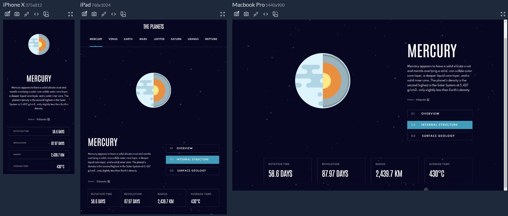

# PLANETS FACT SITE

Planets fact site is a responsive web page project created based on a Figma design layout provided by FrontendMentor. It's built using HTML, SASS for maintainable styles, and Gulp for task automation during development and the build process.

## Features:

- Responsive design for various screen sizes.
- Utilizes SASS for modular and maintainable styles.
- Gulp task automation for development and build processes.

### FrontendMentor Challenge:

[https://www.frontendmentor.io/challenges/planets-fact-site-gazqN8w_f](https://www.frontendmentor.io/challenges/planets-fact-site-gazqN8w_f)

### Demo:

[https://ronaldodev03.github.io/planets-fact-site-sass-gulp/](https://ronaldodev03.github.io/planets-fact-site-sass-gulp/)
